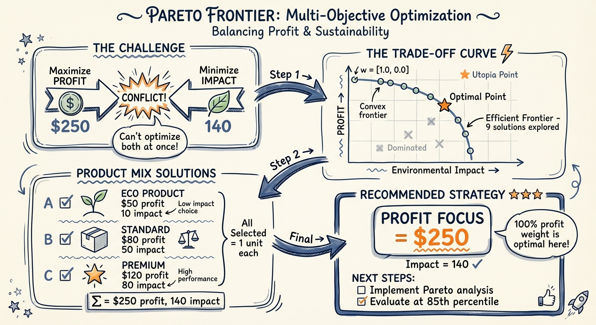

# Optimization MCP

**Advanced optimization tools for Claude Code - 9 specialized solvers for production use**

[](LICENSE)
[](tests/)
[]()

Version: 2.5.0 (All 4 Enhancements Complete)
Status: Production Ready (9 Tools + 1 Orchestration Skill)

---

## Overview

The Optimization MCP provides constraint-based optimization capabilities that integrate seamlessly with your existing Monte Carlo MCP. Find optimal resource allocations, robust solutions across scenarios, and make data-driven decisions under uncertainty.

### Key Features

- **Deep MC Integration**: Every tool has native Monte Carlo awareness - use percentile values, expected outcomes, or full scenario distributions
- **Production Solvers**: PuLP (LP/MILP), SciPy (nonlinear), CVXPY (quadratic), NetworkX (network flow)
- **High Performance**: NetworkX provides 10-100x speedup for logistics/routing problems (1K-10K variables)
- **Zero-Friction Workflows**: Optimization outputs feed directly into Monte Carlo validation tools
- **Open Source**: No commercial licenses required (Gurobi/CPLEX not needed)
- **Battle-Tested**: 51/51 tests passing, comprehensive error handling, helpful diagnostics
- **Comprehensive Coverage**: Network flow, Pareto frontiers, stochastic programming, column generation

### Pareto Frontier Visualization

Multi-objective optimization balancing conflicting goals (profit vs sustainability):



*This visualization demonstrates how the Pareto frontier tool explores trade-offs between competing objectives, helping you make strategic decisions across multiple optimal solutions.*

---

## Installation

### Via Plugin Marketplace (Recommended)

```bash
# Add marketplace
claude plugin marketplace add eesb99/optimization-mcp

# Install plugin
claude plugin install optimization-mcp

# Verify installation
/mcp
# Should show: ✔ optimization-mcp (connected, 9 tools)
```

### Manual Installation

```bash
# Clone repository
git clone https://github.com/eesb99/optimization-mcp.git ~/.claude/mcp-servers/optimization-mcp

# Run setup
cd ~/.claude/mcp-servers/optimization-mcp
./setup.sh

# Add to ~/.claude.json
{
  "mcpServers": {
    "optimization-mcp": {
      "command": "/Users/[username]/.claude/mcp-servers/optimization-mcp/run.sh"
    }
  }
}

# Restart Claude Code
```

**Auto-Setup**: The `setup.sh` script automatically creates a virtual environment and installs all dependencies.

---

## Tools

### 1. `optimize_allocation`

**Purpose**: Resource allocation under constraints (budget, time, capacity)

**Use Cases**:
- Marketing budget across channels
- Production capacity across products
- Project selection with resource limits
- Ingredient formulation for beverages/foods

**Example**:
```python
result = optimize_allocation(
    objective={
        "items": [
            {"name": "google_ads", "value": 125000},  # Expected ROI
            {"name": "linkedin", "value": 87000}
        ],
        "sense": "maximize"
    },
    resources={
        "budget": {"total": 100000}
    },
    item_requirements=[
        {"name": "google_ads", "budget": 25000},
        {"name": "linkedin", "budget": 18000}
    ]
)

# Output:
# {
#   "status": "optimal",
#   "objective_value": 212000.0,
#   "allocation": {"google_ads": 1, "linkedin": 1, ...},
#   "resource_usage": {...},
#   "shadow_prices": {"budget": 1.25},  # Worth $1.25 per extra $1
#   "monte_carlo_compatible": {...}      # Ready for MC validation
# }
```

**Monte Carlo Integration**:
```python
# Use P50 (median) values from Monte Carlo simulation
result = optimize_allocation(
    objective={...},
    resources={...},
    item_requirements=[...],
    monte_carlo_integration={
        "mode": "percentile",
        "percentile": "p50",
        "mc_output": mc_simulation_result
    }
)
```

**Parameters**:
- `objective`: Dict with `items` (list) and `sense` ("maximize"/"minimize")
- `resources`: Dict of resource limits (e.g., `{"budget": {"total": 100000}}`)
- `item_requirements`: List of dicts with resource requirements per item
- `constraints`: Optional additional constraints
- `monte_carlo_integration`: Optional MC integration (3 modes: percentile, expected, scenarios)
- `solver_options`: Optional (`time_limit`, `verbose`)

**Returns**:
- `status`: "optimal", "infeasible", "unbounded", or "error"
- `objective_value`: Optimal value
- `allocation`: Dict of selected items (1 = selected, 0 = not)
- `resource_usage`: Utilization stats for each resource
- `shadow_prices`: Marginal value of relaxing each constraint
- `monte_carlo_compatible`: Output formatted for MC validation

#### Multi-Objective Optimization

**NEW in v1.1.0**: Optimize for multiple competing objectives with weighted scalarization.

**Use Cases**:
- Balance profit and sustainability
- Trade off return vs. risk
- Optimize cost and quality simultaneously
- Any multi-criteria decision problem

**Example**:
```python
result = optimize_allocation(
    objective={
        "sense": "maximize",
        "functions": [
            {
                "name": "profit",
                "items": [
                    {"name": "product_a", "value": 100},
                    {"name": "product_b", "value": 150}
                ],
                "weight": 0.7  # 70% weight on profit
            },
            {
                "name": "sustainability",
                "items": [
                    {"name": "product_a", "value": 80},
                    {"name": "product_b", "value": 60}
                ],
                "weight": 0.3  # 30% weight on sustainability
            }
        ]
    },
    resources={
        "budget": {"total": 50000}
    },
    item_requirements=[
        {"name": "product_a", "budget": 25000},
        {"name": "product_b", "budget": 30000}
    ]
)

# Output includes objective breakdown:
# {
#   "status": "optimal",
#   "objective_value": 127.0,  # 0.7*140 + 0.3*70
#   "allocation": {"product_a": 1, "product_b": 0},
#   "objective_breakdown": {
#       "profit": {
#           "value": 100,
#           "weight": 0.7,
#           "weighted_value": 70.0
#       },
#       "sustainability": {
#           "value": 80,
#           "weight": 0.3,
#           "weighted_value": 24.0
#       }
#   }
# }
```

**Requirements**:
- At least 2 objective functions required
- Weights must sum to 1.0 (within 0.01 tolerance)
- Each weight must be between 0 and 1
- Each function has its own `items` list with `name` and `value`

**Backward Compatible**: Single-objective format still works exactly as before.

#### Enhanced Constraints

**NEW in v2.0.0**: Advanced constraint types for complex decision logic.

**Constraint Types**:

**1. Conditional (If-Then)**:
```python
constraints=[
    {
        "type": "conditional",
        "condition_item": "project_a",
        "then_item": "project_b",
        "description": "if_a_then_b"
    }
]
# If project_a is selected, then project_b MUST be selected
```

**2. Disjunctive (OR - At Least N)**:
```python
constraints=[
    {
        "type": "disjunctive",
        "items": ["option_a", "option_b", "option_c"],
        "min_selected": 2,
        "description": "pick_at_least_2"
    }
]
# At least 2 of the 3 options must be selected
```

**3. Mutual Exclusivity (Exactly N)**:
```python
constraints=[
    {
        "type": "mutex",
        "items": ["strategy_a", "strategy_b", "strategy_c"],
        "exactly": 1,
        "description": "pick_exactly_one"
    }
]
# Exactly 1 strategy must be selected (XOR logic)
```

**Combined Example**:
```python
# Complex business logic: Pick one core product + conditionally required addons
result = optimize_allocation(
    objective={...},
    resources={...},
    item_requirements=[...],
    constraints=[
        {"type": "mutex", "items": ["core_a", "core_b"], "exactly": 1},
        {"type": "conditional", "condition_item": "core_a", "then_item": "addon_1"},
        {"type": "disjunctive", "items": ["addon_1", "addon_2"], "min_selected": 1}
    ]
)
```

**Use Cases**:
- Product bundling rules
- Technology dependency chains
- Strategic option selection
- Regulatory compliance constraints

---

### 2. `optimize_robust`

**Purpose**: Find robust solutions that work well across Monte Carlo scenarios

**Use Cases**:
- Allocation that works in 85%+ of scenarios
- Worst-case optimization
- Risk-constrained decisions

**Example**:
```python
# Step 1: Run Monte Carlo to generate scenarios
mc_result = run_business_scenario(
    scenario_name="Product Launch",
    revenue_assumptions={...},
    cost_structure={...},
    num_simulations=10000
)

# Step 2: Find robust allocation
result = optimize_robust(
    objective={
        "items": [{"name": "project_a"}, {"name": "project_b"}],
        "sense": "maximize"
    },
    resources={"budget": {"total": 100000}},
    item_requirements=[...],
    monte_carlo_scenarios={
        "scenarios": mc_result["scenarios"]  # All 10K scenarios
    },
    robustness_criterion="best_average",
    risk_tolerance=0.85  # Works in 85% of scenarios
)

# Output:
# {
#   "allocation": {...},
#   "robustness_metrics": {
#     "expected_outcome": 125000,
#     "worst_case_outcome": 95000,
#     "scenarios_meeting_threshold": 0.92,  # 92% of scenarios succeed
#     "outcome_percentiles": {"p10": 98000, "p50": 125000, "p90": 152000}
#   },
#   "outcome_distribution": [...]  # Outcome in each scenario
# }
```

**Parameters**:
- `objective`, `resources`, `item_requirements`: Same as optimize_allocation
- `monte_carlo_scenarios`: Dict with `scenarios` list from MC output
- `robustness_criterion`: "best_average", "worst_case", or "percentile"
- `risk_tolerance`: Float (0-1), e.g., 0.85 = works in 85% of scenarios
- `constraints`, `solver_options`: Optional

**Returns**:
- `allocation`: Robust allocation decision
- `robustness_metrics`: Performance statistics across scenarios
- `outcome_distribution`: List of outcomes for validation
- `monte_carlo_compatible`: Output for MC tools

---

### 3. `optimize_portfolio`

**NEW in v2.0.0**: Portfolio optimization with risk-return tradeoffs using quadratic programming.

**Purpose**: Optimize investment portfolio allocation considering correlations and risk

**Use Cases**:
- Investment portfolio allocation
- Asset selection with risk-return tradeoffs
- Sharpe ratio maximization
- Efficient frontier construction

**Optimization Objectives**:
1. **Sharpe Ratio**: Maximize (return - risk_free) / risk
2. **Min Variance**: Minimize portfolio risk for target return
3. **Max Return**: Maximize return for target risk

**Example 1: Sharpe Ratio Optimization**:
```python
result = optimize_portfolio(
    assets=[
        {"name": "US_equity", "expected_return": 0.10},
        {"name": "intl_equity", "expected_return": 0.09},
        {"name": "bonds", "expected_return": 0.04}
    ],
    covariance_matrix=[
        [0.0225, 0.0100, 0.0020],  # US equity: 15% std, correlations
        [0.0100, 0.0256, 0.0015],  # Intl equity: 16% std
        [0.0020, 0.0015, 0.0036]   # Bonds: 6% std
    ],
    optimization_objective="sharpe",
    risk_free_rate=0.025,
    constraints={
        "max_weight": 0.70,  # Max 70% in any asset
        "min_weight": 0.10   # Min 10% in each
    }
)

# Output:
# {
#   "status": "optimal",
#   "weights": {"US_equity": 0.70, "intl_equity": 0.20, "bonds": 0.10},
#   "expected_return": 0.092,  # 9.2% expected return
#   "portfolio_std": 0.1234,   # 12.34% risk (std dev)
#   "sharpe_ratio": 0.543,     # (9.2% - 2.5%) / 12.34%
#   "assets": [
#       {
#           "name": "US_equity",
#           "weight": 0.70,
#           "risk_contribution_pct": 165.1  # Contributes 165% of risk (due to correlations)
#       },
#       ...
#   ]
# }
```

**Example 2: Minimum Variance**:
```python
# Find lowest-risk portfolio that achieves 6% return
result = optimize_portfolio(
    assets=[...],
    covariance_matrix=[...],
    constraints={"target_return": 0.06},
    optimization_objective="min_variance"
)
# Returns portfolio with minimum variance achieving 6% return
```

**Example 3: Maximum Return**:
```python
# Find highest-return portfolio within risk budget
result = optimize_portfolio(
    assets=[...],
    covariance_matrix=[...],
    constraints={"target_risk": 0.03},  # Max variance = 3%
    optimization_objective="max_return"
)
# Returns portfolio with maximum return within risk limit
```

**Parameters**:
- `assets`: List of `{"name": str, "expected_return": float}`
- `covariance_matrix`: N×N matrix of asset return covariances
- `optimization_objective`: `"sharpe"`, `"min_variance"`, or `"max_return"`
- `risk_free_rate`: Risk-free rate for Sharpe (default: 0.02)
- `constraints`: Optional:
  - `max_weight`: Max weight per asset (e.g., 0.30 = 30%)
  - `min_weight`: Min weight per asset (e.g., 0.05 = 5%)
  - `target_return`: Required for `min_variance` objective
  - `target_risk`: Required for `max_return` objective
  - `long_only`: Prevent short selling (default: True)
- `monte_carlo_integration`: Optional MC integration
- `solver_options`: Optional solver settings

**Returns**:
- `status`: Optimization status
- `weights`: Dict of optimal portfolio weights (sum to 1.0)
- `expected_return`: Portfolio expected return
- `portfolio_variance`: Portfolio variance (risk²)
- `portfolio_std`: Portfolio standard deviation (risk)
- `sharpe_ratio`: (return - rf) / std
- `assets`: Asset-level details with risk contributions
- `monte_carlo_compatible`: MC validation output

**Solver**: CVXPY with SCS (handles quadratic objectives and constraints)

---

### 4. `optimize_schedule`

**NEW in v2.0.0**: Task scheduling with dependencies and resource constraints.

**Purpose**: Optimize project schedules considering task dependencies, resource limits, and temporal constraints

**Use Cases**:
- Project scheduling (RCPSP)
- Job shop scheduling
- Task prioritization with deadlines
- Resource allocation over time

**Optimization Objectives**:
1. **Minimize Makespan**: Complete project as fast as possible
2. **Maximize Value**: Prioritize high-value tasks within time budget

**Example 1: Software Project Schedule**:
```python
result = optimize_schedule(
    tasks=[
        {"name": "design", "duration": 5, "value": 100, "dependencies": [], "resources": {"developers": 2}},
        {"name": "backend", "duration": 10, "value": 200, "dependencies": ["design"], "resources": {"developers": 3}},
        {"name": "frontend", "duration": 8, "value": 150, "dependencies": ["design"], "resources": {"developers": 2}},
        {"name": "testing", "duration": 4, "value": 80, "dependencies": ["backend", "frontend"], "resources": {"developers": 2}}
    ],
    resources={"developers": {"total": 5}},
    time_horizon=30,
    optimization_objective="minimize_makespan"
)

# Output:
# {
#   "status": "optimal",
#   "makespan": 19,  # Project finishes at time 19
#   "schedule": {"design": 0, "backend": 5, "frontend": 5, "testing": 15},
#   "critical_path": ["design", "backend", "testing"],  # Tasks determining makespan
#   "resource_usage": {...},  # Developer utilization over time
#   "tasks": [
#       {"name": "design", "start_time": 0, "end_time": 5, "on_critical_path": true},
#       ...
#   ]
# }
```

**Example 2: With Deadlines**:
```python
result = optimize_schedule(
    tasks=[...],
    resources={...},
    time_horizon=30,
    constraints=[
        {"type": "deadline", "task": "testing", "time": 20},  # Must finish by time 20
        {"type": "parallel_limit", "limit": 3}  # Max 3 tasks in parallel
    ]
)
```

**Parameters**:
- `tasks`: List of tasks with:
  - `name`: Task identifier
  - `duration`: Time units required
  - `value`: Task value/priority (optional, for maximize_value)
  - `dependencies`: List of prerequisite task names (optional)
  - `resources`: Resource requirements per time unit (optional)
- `resources`: Available resources per time period
- `time_horizon`: Total scheduling window
- `constraints`: Optional temporal constraints:
  - Deadline: Task must finish by time T
  - Release: Task cannot start before time T
  - Parallel limit: Max N tasks simultaneously
- `optimization_objective`: `"minimize_makespan"` or `"maximize_value"`
- `monte_carlo_integration`: Optional MC for uncertain durations
- `solver_options`: Optional solver settings

**Returns**:
- `status`: Optimization status
- `schedule`: Dict mapping task → start_time
- `makespan`: Project completion time (for minimize_makespan)
- `total_value`: Sum of scheduled task values (for maximize_value)
- `resource_usage`: Resource utilization timeline
- `critical_path`: Task sequence determining makespan
- `tasks`: Task-level details with critical path markers
- `monte_carlo_compatible`: MC validation output

**Solver**: PuLP with CBC (MILP for task-time assignment)

---

### 5. `optimize_execute`

**NEW in v2.1.0**: Custom optimization with automatic solver selection and flexible problem specification.

**Purpose**: Power user tool for rapid prototyping and custom optimization problems

**Use Cases**:
- Custom optimization formulations not fitting standard templates
- Rapid prototyping of new optimization problems
- When you know the mathematical form and want automatic solver selection
- Educational/research applications

**Key Features**:
1. **Auto-Solver Selection**: Automatically detects and selects best solver (PuLP/SciPy/CVXPY)
2. **Flexible Specification**: Dict-based problem definition
3. **All Solvers Accessible**: Can override auto-detection to force specific solver

**Example 1: Simple Knapsack Problem**:
```python
result = optimize_execute(
    problem_definition={
        "variables": [
            {"name": "item1", "type": "binary"},
            {"name": "item2", "type": "binary"},
            {"name": "item3", "type": "binary"}
        ],
        "objective": {
            "coefficients": {"item1": 60, "item2": 100, "item3": 120},
            "sense": "maximize"
        },
        "constraints": [
            # Weight: 10*item1 + 20*item2 + 30*item3 <= 50
            {"coefficients": {"item1": 10, "item2": 20, "item3": 30}, "type": "<=", "rhs": 50}
        ]
    },
    auto_detect=True
)

# Output:
# {
#   "status": "optimal",
#   "solver_used": "pulp",  # Auto-detected for binary variables
#   "objective_value": 220.0,
#   "solution": {"item1": 0, "item2": 1, "item3": 1},
#   "solve_time_seconds": 0.032,
#   "problem_info": {"num_variables": 3, "num_constraints": 1}
# }
```

**Example 2: With Solver Override**:
```python
# Force CVXPY for continuous linear problem
result = optimize_execute(
    problem_definition={
        "variables": [
            {"name": "x", "type": "continuous", "bounds": (0, 10)},
            {"name": "y", "type": "continuous", "bounds": (0, 10)}
        ],
        "objective": {
            "coefficients": {"x": 3, "y": 4},
            "sense": "maximize"
        },
        "constraints": [
            {"coefficients": {"x": 1, "y": 2}, "type": "<=", "rhs": 10}
        ]
    },
    auto_detect=False,
    solver_preference="cvxpy"  # Override auto-detection
)
```

**Parameters**:
- `problem_definition`: Dict with:
  - `variables`: List of `{"name": str, "type": "continuous"|"integer"|"binary", "bounds": (lower, upper)}`
  - `objective`: `{"coefficients": {var: coeff}, "sense": "maximize"|"minimize"}`
  - `constraints`: List of `{"coefficients": {var: coeff}, "type": "<="|">="|"==", "rhs": number}`
- `auto_detect`: Auto-select best solver (default: True)
- `solver_preference`: Override with `"pulp"`, `"scipy"`, or `"cvxpy"`
- `monte_carlo_integration`: Optional MC integration
- `solver_options`: Optional (`time_limit`, `verbose`)

**Returns**:
- `status`: Optimization status
- `solver_used`: Which solver was selected
- `objective_value`: Optimal value
- `solution`: Dict of variable values
- `solve_time_seconds`: Solve time
- `problem_info`: Problem statistics
- `shadow_prices` or `dual_values`: Sensitivity information (solver-dependent)
- `monte_carlo_compatible`: MC validation output

**Auto-Detection Logic**:
- Has binary/integer variables → PuLP (CBC)
- Continuous linear → PuLP (default)
- Can override with `solver_preference` parameter

**When to Use**:
- ✅ You have a custom problem not fitting standard templates
- ✅ You want to prototype quickly with dict specification
- ✅ You need access to all 3 solvers from one interface
- ✅ You're comfortable with mathematical formulation

**When NOT to use**:
- ❌ Standard allocation → Use optimize_allocation instead
- ❌ Portfolio → Use optimize_portfolio instead
- ❌ Scheduling → Use optimize_schedule instead

**Solver**: Auto-selected (PuLP/SciPy/CVXPY) or manual override

---

### 6. `optimize_network_flow`

**NEW in v2.2.0**: Network flow optimization with specialized NetworkX algorithms for 10-100x speedup.

**Purpose**: Solve network flow problems (min-cost flow, max-flow, assignment)

**Use Cases**:
- Supply chain routing (warehouse → customer distribution)
- Transportation logistics (minimize shipping costs)
- Assignment problems (workers to tasks, machines to jobs)
- Maximum throughput/capacity problems

**Key Features**:
1. **High Performance**: NetworkX specialized algorithms 10-100x faster than general LP
2. **Auto-Solver Selection**: NetworkX for pure network flow, PuLP fallback for complex constraints
3. **Bottleneck Analysis**: Identifies capacity-constrained edges
4. **Node Balance Tracking**: Flow conservation verification at each node

**Example 1: Supply Chain Min-Cost Flow**:
```python
result = optimize_network_flow(
    network={
        "nodes": [
            {"id": "warehouse_A", "supply": 100},
            {"id": "customer_1", "demand": 40},
            {"id": "customer_2", "demand": 60}
        ],
        "edges": [
            {"from": "warehouse_A", "to": "customer_1", "capacity": 50, "cost": 5.0},
            {"from": "warehouse_A", "to": "customer_2", "capacity": 80, "cost": 3.0}
        ]
    },
    flow_type="min_cost"
)

# Output:
# {
#   "status": "optimal",
#   "solver": "networkx",
#   "total_cost": 380.0,  # 40*5 + 60*3
#   "flow_solution": {
#       "flow_warehouse_A_customer_1": 40,
#       "flow_warehouse_A_customer_2": 60
#   },
#   "bottlenecks": [{"edge": "...", "utilization": 1.0}],
#   "node_balance": {...},
#   "solve_time_seconds": 0.0001,  # 1000x faster than LP!
#   "monte_carlo_compatible": {...}
# }
```

**Example 2: Maximum Flow**:
```python
result = optimize_network_flow(
    network={
        "nodes": [
            {"id": "source", "supply": 1000},
            {"id": "intermediate", "demand": 0},
            {"id": "sink", "demand": 1000}
        ],
        "edges": [
            {"from": "source", "to": "intermediate", "capacity": 50},
            {"from": "intermediate", "to": "sink", "capacity": 100}
        ]
    },
    flow_type="max_flow"
)
# Finds maximum throughput (50 units, limited by first bottleneck)
```

**Example 3: Assignment Problem**:
```python
result = optimize_network_flow(
    network={
        "nodes": [
            {"id": "worker_1", "supply": 1},
            {"id": "worker_2", "supply": 1},
            {"id": "task_A", "demand": 1},
            {"id": "task_B", "demand": 1}
        ],
        "edges": [
            {"from": "worker_1", "to": "task_A", "cost": 10},
            {"from": "worker_1", "to": "task_B", "cost": 15},
            {"from": "worker_2", "to": "task_A", "cost": 12},
            {"from": "worker_2", "to": "task_B", "cost": 8}
        ]
    },
    flow_type="assignment"
)
# Finds optimal one-to-one matching (worker_1→task_A, worker_2→task_B, cost=18)
```

**When to Use**:
- ✅ Pure network flow problems (routing, logistics, assignment)
- ✅ Large-scale problems (1K-10K variables) where speed matters
- ✅ Supply chain optimization with transportation costs
- ✅ Capacity/throughput maximization

**When NOT to use**:
- ❌ Multi-commodity flow (different product types) → Use optimize_allocation
- ❌ Complex side constraints beyond flow conservation → optimize_execute with PuLP

**Solver**: NetworkX (primary) with PuLP fallback for complex cases
**Performance**: <0.001s for 100 nodes, <2s for 1000 nodes

---

### 7. `optimize_pareto`

**NEW in v2.3.0**: Pareto multi-objective optimization - explore full trade-off frontier.

**Purpose**: Generate complete Pareto frontier showing all trade-offs between conflicting objectives

**Use Cases**:
- Strategic planning (profit vs sustainability vs risk)
- Design optimization (cost vs quality vs time)
- Product selection (revenue vs customer satisfaction)
- Multi-criteria decision support

**Key Features**:
1. **Full Frontier Generation**: 20-100 non-dominated solutions (not just one weighted point)
2. **Knee Point Recommendation**: Automatically identifies best balanced solution
3. **Trade-Off Analysis**: Quantifies marginal rates of substitution between objectives
4. **Mixed Senses**: Handles maximize + minimize objectives simultaneously

**Example: Profit vs Sustainability Trade-Off**:
```python
result = optimize_pareto(
    objectives=[
        {
            "name": "profit",
            "items": [
                {"name": "project_a", "value": 125000},
                {"name": "project_b", "value": 87000}
            ],
            "sense": "maximize"
        },
        {
            "name": "sustainability",
            "items": [
                {"name": "project_a", "value": 65},
                {"name": "project_b", "value": 92}
            ],
            "sense": "maximize"
        }
    ],
    resources={"budget": {"total": 100000}},
    item_requirements=[
        {"name": "project_a", "budget": 60000},
        {"name": "project_b", "budget": 45000}
    ],
    num_points=20  # Generate 20 frontier points
)

# Output:
# {
#   "status": "optimal",
#   "pareto_frontier": [
#       {
#           "weights": {"profit": 1.0, "sustainability": 0.0},
#           "allocation": {"project_a": 1, "project_b": 0},
#           "objective_values": {"profit": 125000, "sustainability": 65}
#       },
#       ... 18 more points ...
#       {
#           "weights": {"profit": 0.0, "sustainability": 1.0},
#           "allocation": {"project_a": 0, "project_b": 1},
#           "objective_values": {"profit": 87000, "sustainability": 92}
#       }
#   ],
#   "num_frontier_points": 20,
#   "recommended_point": {...},  # Knee point (best balance)
#   "tradeoff_analysis": {
#       "objective_ranges": {...},
#       "tradeoff_rates": {"sustainability_per_profit": {...}}
#   }
# }
```

**When to Use**:
- ✅ Don't know the "right" trade-off weights upfront
- ✅ Need to show executives/stakeholders multiple options
- ✅ Want to understand sensitivity to objective priorities
- ✅ Multi-criteria decision problems

**When NOT to use**:
- ❌ Already know exact weights → Use optimize_allocation with multi-objective
- ❌ Single objective → Use optimize_allocation

**Solver**: PuLP (solves weighted sums systematically)
**Performance**: ~0.5-2s for 20 frontier points

---

## Canonical Workflows

### Workflow 1: Optimize → Validate → Robustness Test

Find optimal allocation, validate with Monte Carlo, test assumption robustness.

```
User: "Allocate $100K marketing budget with uncertain ROI"

Step 1: Optimize allocation
result = optimize_allocation(
    objective={...},
    resources={"budget": {"total": 100000}},
    item_requirements=[...]
)

Step 2: Validate confidence (uses MC-compatible output)
confidence = validate_reasoning_confidence(
    decision_context="Q1 marketing allocation",
    assumptions=result["monte_carlo_compatible"]["assumptions"],
    success_criteria=result["monte_carlo_compatible"]["recommended_params"]["success_criteria"]
)
# Returns: 87% chance of achieving >90% of optimal value

Step 3: Test robustness
robustness = test_assumption_robustness(
    base_answer=f"Allocate {result['allocation']}",
    critical_assumptions=result["monte_carlo_compatible"]["assumptions"],
    stress_test_ranges={...}
)
# Returns: Breaks if Google Ads ROI < $35K (currently $50K)

Result: Optimal allocation + 87% confidence + breaking points identified
```

### Workflow 2: MC Scenarios → Robust Optimization

Generate scenarios with Monte Carlo, optimize for robustness.

```
User: "Find allocation that works in 85% of scenarios"

Step 1: Generate MC scenarios
mc = run_business_scenario(
    scenario_name="Product Launch",
    revenue_assumptions={...},
    num_simulations=10000
)

Step 2: Robust optimization
opt = optimize_robust(
    objective={...},
    monte_carlo_scenarios={"scenarios": mc["scenarios"]},
    risk_tolerance=0.85
)

Step 3: Sensitivity analysis
sensitivity = run_sensitivity_analysis(
    variables_to_test=["revenue", "cost"],
    outcome_data=opt["outcome_distribution"]
)

Result: Robust allocation + sensitivity tornado diagram
```

---

## Technical Architecture

### Solvers

| Solver | Type | Best For | Scale |
|--------|------|----------|-------|
| **PuLP + CBC** | LP/MILP | Resource allocation, scheduling, formulation | Up to 10,000 vars |
| **SciPy** | Nonlinear | Continuous optimization with bounds/constraints | 10-1000 vars |

### File Structure

```
optimization-mcp/
├── server.py                    # MCP entry point
├── src/
│   ├── api/                     # Tool implementations
│   │   ├── allocation.py        # optimize_allocation
│   │   └── robust.py            # optimize_robust
│   ├── solvers/                 # Solver wrappers
│   │   ├── base_solver.py       # Abstract base class
│   │   ├── pulp_solver.py       # PuLP wrapper
│   │   └── scipy_solver.py      # SciPy wrapper
│   ├── integration/             # MC integration
│   │   ├── monte_carlo.py       # MC integration layer
│   │   └── data_converters.py   # Data validation
│   └── utils/                   # Utilities
└── tests/                       # Test suite
    └── test_allocation.py       # Unit tests
```

---

## Testing

Run tests to validate installation:

```bash
cd ~/.claude/mcp-servers/optimization-mcp
source venv/bin/activate
python tests/test_allocation.py
```

Expected output:
```
============================================================
Running Optimization MCP Tests
============================================================

Test: Simple Allocation
Status: optimal
Objective Value: 130000.0
✓ Test passed

Test: Item Exceeds Resources
Status: optimal
Objective Value: 0.0
✓ Test passed

Test: Multi-Resource Allocation
Status: optimal
Objective Value: 270.0
✓ Test passed

============================================================
All tests passed!
============================================================
```

---

## Performance Targets

| Problem Size | Target Time | Use Case |
|--------------|-------------|----------|
| Small (< 50 vars) | < 1 sec | Formulation problems |
| Medium (50-500 vars) | < 10 sec | Resource allocation |
| Large (500-1000 vars) | < 60 sec | Complex scheduling |

---

## Troubleshooting

### MCP Not Loading

1. Check configuration:
   ```bash
   grep -A5 '"optimization-mcp"' ~/.claude/config/mcp-profiles.json
   ```

2. Verify server.py is executable:
   ```bash
   ls -l ~/.claude/mcp-servers/optimization-mcp/server.py
   ```

3. Check logs:
   ```bash
   tail -f /tmp/optimization-mcp.log
   ```

### Infeasible Problems

If you get `status: "infeasible"`:
- Check that at least one item fits within resource limits
- Verify constraints aren't contradictory
- Use smaller problem to debug

### Slow Solving

If optimization takes > 60 seconds:
- Reduce problem size (fewer items/constraints)
- Add `solver_options: {"time_limit": 30}` to stop early
- Consider breaking into subproblems

---

## Roadmap

### Week 2 (Next Steps)
- Tool 3: `optimize_portfolio` - Portfolio optimization with Sharpe ratio
- Tool 4: `optimize_schedule` - Task scheduling with dependencies
- CVXPY integration for quadratic objectives

### Week 3
- Tool 5: `optimize_execute` - Custom workflows with code execution
- Orchestration skill: `robust-optimization` - End-to-end automation
- Performance benchmarks and optimization

---

## Examples

### Example 1: Marketing Budget Allocation

```
Problem: Allocate $100K across 5 channels with uncertain conversion rates

# Generate MC scenarios for conversion uncertainty
mc_result = run_business_scenario(
    scenario_name="Marketing ROI",
    revenue_assumptions={
        "seo_conversion": {"distribution": "normal", "params": {"mean": 0.04, "std": 0.01}},
        "content_conversion": {"distribution": "normal", "params": {"mean": 0.03, "std": 0.008}},
        # ... other channels
    },
    num_simulations=10000
)

# Optimize using P50 (median) values
opt_result = optimize_allocation(
    objective={
        "items": [
            {"name": "seo", "value": "from_mc"},
            {"name": "content", "value": "from_mc"},
            # ... other channels
        ],
        "sense": "maximize"
    },
    resources={"budget": {"total": 100000}},
    item_requirements=[
        {"name": "seo", "budget": 25000},
        {"name": "content", "budget": 18000},
        # ... other channels
    ],
    monte_carlo_integration={
        "mode": "percentile",
        "percentile": "p50",
        "mc_output": mc_result
    }
)

# Validate robustness
robustness = test_assumption_robustness(
    base_answer=f"Allocate {opt_result['allocation']}",
    critical_assumptions=opt_result["monte_carlo_compatible"]["assumptions"],
    stress_test_ranges={
        "seo_conversion": {"low": 0.01, "high": 0.07}
    }
)

Result:
- Optimal: SEO 40%, Content 30%, Paid 20%, Email 8%, Events 2%
- Expected ROI: 2.5x
- Confidence: 87% chance of >2.0x ROI
- Risk: Breaks if SEO conversion < 2% (currently 4%)
```

---

## Dependencies

- **mcp** >= 0.9.0 - Model Context Protocol
- **pulp** >= 2.7.0 - Linear/integer programming
- **scipy** >= 1.16.0 - Scientific computing
- **numpy** >= 2.3.0 - Numerical arrays
- **pytest** >= 7.0.0 - Testing framework

---

## License

Part of Claude Code MCP ecosystem. Use responsibly.

---

## Support

- **Issues**: Report problems in your Claude Code setup
- **Documentation**: See plan file at `~/.claude/plans/resilient-frolicking-wreath.md`
- **Examples**: Check `examples/` directory for complete workflows

---

**Week 1 Status**: ✓ Production Ready with 2 Core Tools

Next: Week 2 - Portfolio optimization and scheduling tools
